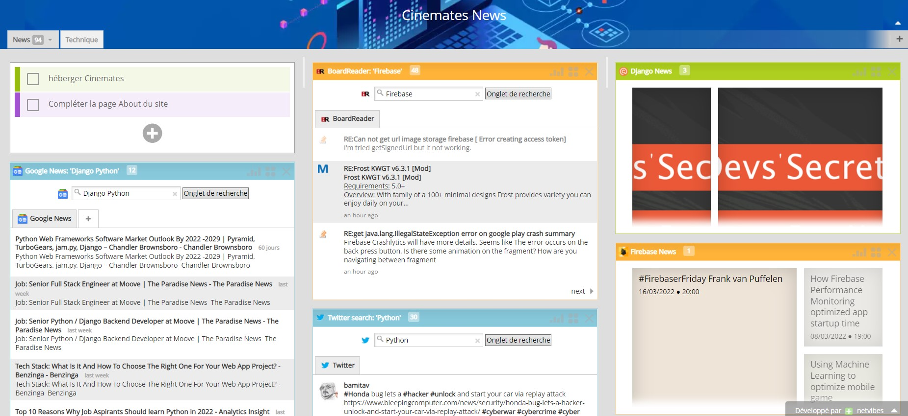
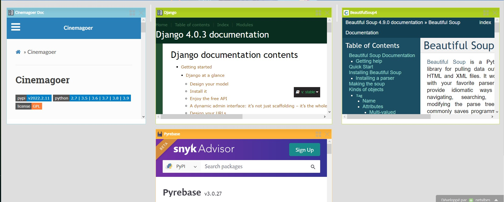
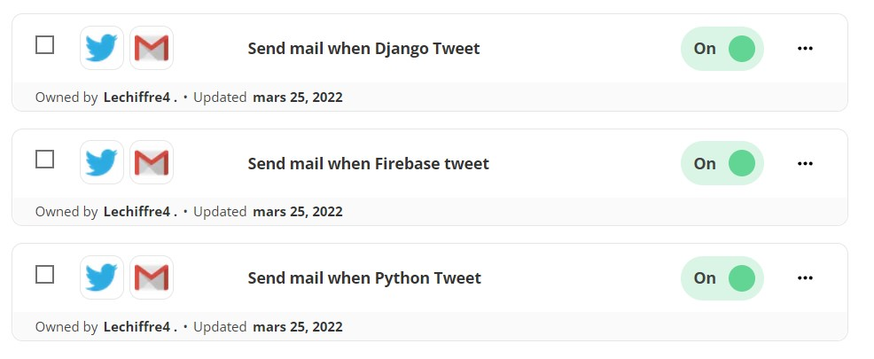
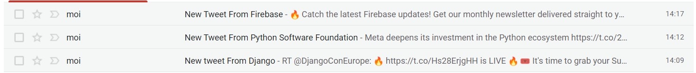

projet-specialise-2022-Lechiffre4

Nom du projet : Cinemates
Developpeur : Sahel HAOUCHET

### Iteration 1
Lien de description du projet:

    https://docs.google.com/document/d/1E-jMtS5L6D9YHmWobS6FsH0-O_F4TqKjvk9nUJYlNmw/edit?usp=sharing

Lien Reflexion successive : 

    https://docs.google.com/presentation/d/1V9QISXXinDiCOKut8Ndx6m5nMJTRvkxGhrm4EnYef_8/edit?usp=sharing

Lien Grille Comparaison :

    https://docs.google.com/presentation/d/16OKcy5TUGGfon0ofFaO_jR8puQjXoZXiFiCSMep6774/edit?usp=sharing

### Iteration 2
Lien Analyse Fonctionnelle :
    https://docs.google.com/presentation/d/1re58kKNUVke3gmdEErb0u9pjwJakxBjTvmAcMY0vqhA/edit?usp=sharing

Technologies utilisées : 

    -   Python Web Django
    -   BeautifulSoup 
    -   Ajax

### Iteration 3 
lien vers la page agrégateur :
https://www.netvibes.com/dashboard/99794916?#News

photos : 

Automatisation Web avec Zapier : 
L'automatisation m'envoie automatiquement un mail quand l'un des outils que j'utilise poste un nouveau tweet.

photo des automatisations : 

photo des mails reçu : 

